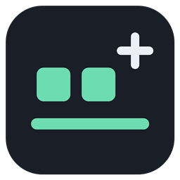

# TaskBar+

A small, local Windows 10 tray app inspired by NiceTaskbar. Defaults to a fully clear taskbar with the existing pinned and running app buttons centered on every connected display.

## Use

Download the latest [Windows build](https://github.com/marcelkolano-alt/TaskBarPlus/releases/latest), extract the ZIP, and open `TaskBarPlus.exe`. The release includes optional install/uninstall scripts. For a stable installation with a Start-menu shortcut and startup enabled, run `install.ps1` from the extracted folder.

Run `build\TaskBarPlus.exe` to open the controls. Closing the window keeps the app running. Double-click its mint-colored tray icon to reopen it, or right-click for effects, pause/resume, and **Exit and restore taskbar**.

Features:

- Clear, Blur, Acrylic, Solid, and Windows-default appearance.
- Custom tint color and 0–100% tint opacity. Solid is always opaque; Windows mode follows the OS.
- Glass, Frost, Midnight, and Sage presets.
- Centered real app buttons, with an optional pixel offset. Start, Search, and the clock stay in their Windows positions.
- Primary-display or all-display operation; repeated discovery handles Explorer recreation and monitor changes.
- Start with Windows, saved preferences, pause/resume, and style reset.
- Optional clock seconds (Windows requires sign-out/sign-in for this persistent clock preference).
- Single instance. Opening the app again brings its existing controls forward.
- Live CPU and RAM usage on tray hover, in the tray menu, and in the settings window.
- In-app GitHub update checks and verified installation with rollback and settings preservation.
- No administrator rights, accounts, or telemetry. Network access occurs only when you request an update check/download.

## Build and install

Run `powershell -NoProfile -File .\build.ps1`, then `powershell -NoProfile -File .\install.ps1`.

The build uses the .NET Framework compiler bundled with Windows. Installation copies the executable to `%LOCALAPPDATA%\Programs\TaskBarPlus`, adds a Start-menu shortcut, enables the current user's startup entry, and starts the app quietly. Startup can be disabled in the app. Source can then be moved without breaking the installed copy.

The same logo appears in the tray, window, executable, and shortcuts. The installer refreshes existing TaskBar+ pins to use the installed icon and executable. If Windows keeps an older cached icon, unpin that shortcut and pin TaskBar+ again from the Start menu.

`uninstall.ps1` exits cleanly, removes the executable, shortcut, and startup entry, and preserves preferences and source. It does not restart Explorer or close any other apps.

## Compatibility and behavior

Designed for the classic Windows 10 taskbar, version 1809 or later. Windows 11 is intentionally rejected: it has a different taskbar implementation. Appearance uses an undocumented Windows composition API, as other taskbar utilities do, so a future Windows change may require an update. Avoid running another taskbar appearance/centering utility at the same time.

Centering follows the complete pinned/running app group, rather than rearranging individual pins. On a crowded bar it clamps to the usable region; Windows continues to handle overflow. Centering is checked once per second. Taskbar handles are cached, with discovery every five seconds or immediately when a known handle becomes invalid. New displays are picked up within five seconds. Horizontal and vertical geometry are supported; the tested machine uses two horizontal taskbars.

Pause and normal exit restore the captured app-button positions and ask Explorer to restore its native appearance. **Reset style** selects Windows appearance and Windows alignment while keeping startup and clock preferences. Forced process termination cannot run cleanup; restarting Explorer or signing out restores the Windows taskbar. TaskBar+ does not restart Explorer automatically.

Preferences and diagnostics are in `%LOCALAPPDATA%\TaskBarPlus`. The executable accepts `--background`, `--quit`, `--diagnose`, and `--self-test`. Diagnostics contain taskbar geometry only, not app-button names.

## Development validation

Automated checks cover taskbar geometry, preference validation and persistence, and all nine embedded icon sizes. Live checks passed on a Windows 10 system with two displays, including centering within one pixel, native acceptance of all effect modes, pause/resume, and restoration on exit. Startup registration and single-instance operation were checked. A full sign-out/startup cycle was not performed. The WPF layout was rendered and visually inspected; native taskbar effects were verified through API results rather than desktop screenshots.

For developers, `--integration-test` briefly cycles the effects and restores the taskbar; exit the tray app first (it refuses to run concurrently). `--render-preview` renders the settings layout to a PNG without capturing the desktop. Results are saved beside the preferences.

## Resource usage

Hover the TaskBar+ tray icon for CPU and RAM, or right-click it and open **Resource usage**. The same readings and process ID appear at the bottom of the settings window. **Open Task Manager** provides Windows' own process and startup views.

CPU is sampled over five-second intervals and normalized across the logical processors available to the process. RAM is the process working set, displayed in MB (binary megabytes); this can differ from Task Manager's private-working-set column. These measurements cover TaskBar+ itself, not Explorer/DWM rendering or Windows' startup-impact rating. The monitor keeps no history, writes no periodic logs, and sends no telemetry. Closing the settings window releases its controls and native window; the runtime decides when to reclaim memory. The app does not force garbage collection or trim its working set to make readings look smaller.

## Updating

Click **Check for updates** in the app. When a newer stable GitHub release is available, the button changes to **Install v…**. Updates are checked only on request; there is no background network polling.

The updater only accepts this repository's Windows x64 release ZIP, verifies its SHA-256 digest from GitHub, and extracts only the executable and icon to fixed paths. It replaces the current executable in place, preserves preferences and startup/shortcut paths, and restarts. A temporary previous-version backup is retained until the new app signals a successful start; it is then removed. A failed replacement/start attempts to restore and restart the previous version. Completed staging files are cleaned up after startup. A portable copy can also update itself if its folder is writable.

This updates published release builds, not unreleased source commits. Future releases must keep the asset name `TaskBarPlus-VERSION-windows-x64.zip`, with `TaskBarPlus.exe` and `assets/TaskBarPlus.ico` inside. Run `--test-updater` for version, source, integrity, package, and file-replacement tests.

## Reference research

[NiceTaskbar's customization section](https://nicetaskbar.com/#Customization) advertises transparency, alignment, spacing, blur, animation, auto-hide, themes, and layout controls. The [Microsoft Store listing](https://apps.microsoft.com/detail/9pkl2s93xwb5?hl=en-US&gl=US), inspected September 29, 2026, specifically describes transparent, blur and acrylic effects, color/opacity, themes and tray control. Its screenshots show appearance presets and startup controls. Older documented versions include centered buttons and clock seconds.

This is an independent implementation of the core appearance/centering workflow, not a pixel-for-pixel clone or a claim of full feature parity. Custom icon spacing, animated transitions, per-app profiles, plugin systems, and auto-hide enhancements are not implemented. The website's broader claims were not independently verified against the Store app. No NiceTaskbar binaries or artwork are included.

Native API references: [SetWindowPos](https://learn.microsoft.com/en-us/windows/win32/api/winuser/nf-winuser-setwindowpos), [AccessibleObjectFromWindow](https://learn.microsoft.com/en-us/windows/win32/api/oleacc/nf-oleacc-accessibleobjectfromwindow). Existing taskbar utilities, including [TranslucentTB](https://github.com/TranslucentTB/TranslucentTB) and [CenterTaskbar](https://github.com/mdhiggins/CenterTaskbar), provided context for the approach; source here was written for this project.

## Logo assets

`assets/logo.svg` is the editable vector mark, `assets/logo.png` is the preview, and `assets/TaskBarPlus.ico` contains 16, 20, 24, 32, 40, 48, 64, 128, and 256px versions. Run `tools\build-icons.ps1` to regenerate the raster assets from the matching vector geometry in `tools/IconBuilder.cs`. The executable embeds the ICO as both a native Windows icon resource and a managed resource for the tray and settings window.

The icon retains its charcoal tile, two mint squares, mint bar, and white plus. Each raster size fits the geometry to its own pixel grid, keeping the plus at least one pixel thick and the mint elements separate. The icon builder also writes a native-size review sheet to `build/icon-preview/icon-size-check.png`.
